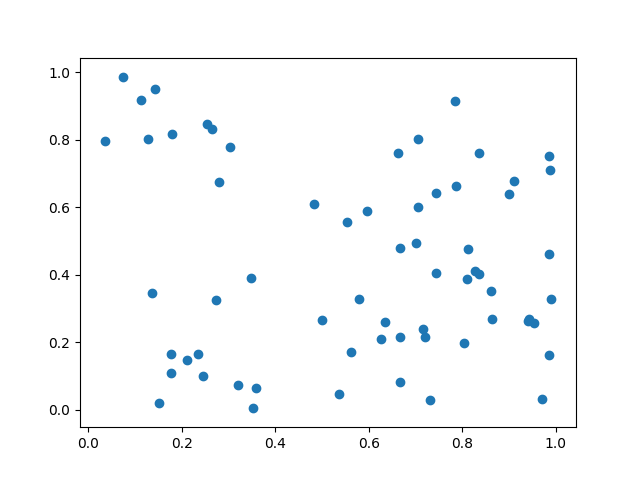

# sobol

This project explores the Sobol' family of generators, which produce
[low-discrepancy sequences][lds] in high dimensions. We use the direction
numbers and primitive polynomials shared in the below paper by Joe and Kuo.

# Plots

These plots compare the first two dimensions of the Sobol' generator against
Python's [`random.random()`][rnd] generator at 16, 64, 256, and 1024 samples.

| Sobol                                  | Uniform                                     |
|----------------------------------------|---------------------------------------------|
|      |       |
|      |       |
|    |     |
|  |   |

# References

- [Physically Based Rendering, Ch. 7: Sampling and Reconstruction][pbr]
- [Sobol Sequence Generator][web]
- [P. Bratley and B. L. Fox, Algorithm 659: Implementing Sobol’s quasirandom sequence generator][imp]
- [S. Joe and F. Y. Kuo, Constructing Sobol sequences with better two-dimensional projections][css]

# See Also

- [sobol-rs][sr]

[lds]: https://en.wikipedia.org/wiki/Low-discrepancy_sequence
[rnd]: https://docs.python.org/3/library/random.html#random.random
[pbr]: http://www.pbr-book.org/3ed-2018/Sampling_and_Reconstruction.html
[web]: https://web.maths.unsw.edu.au/~fkuo/sobol/index.html
[imp]: https://dl.acm.org/doi/10.1145/42288.214372
[css]: https://www.semanticscholar.org/paper/Constructing-Sobol-Sequences-with-Better-Joe-Kuo/e053815647cf7bbc7df4f4fafb1ceed8e1b5008d
[sr]: https://github.com/wsiegenthaler/sobol-rs
